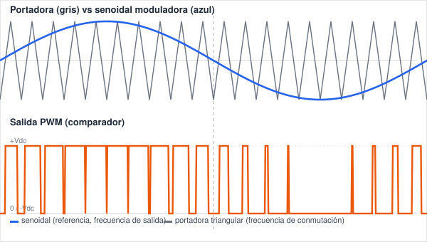
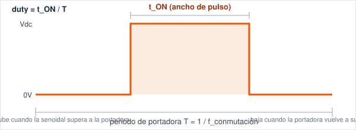
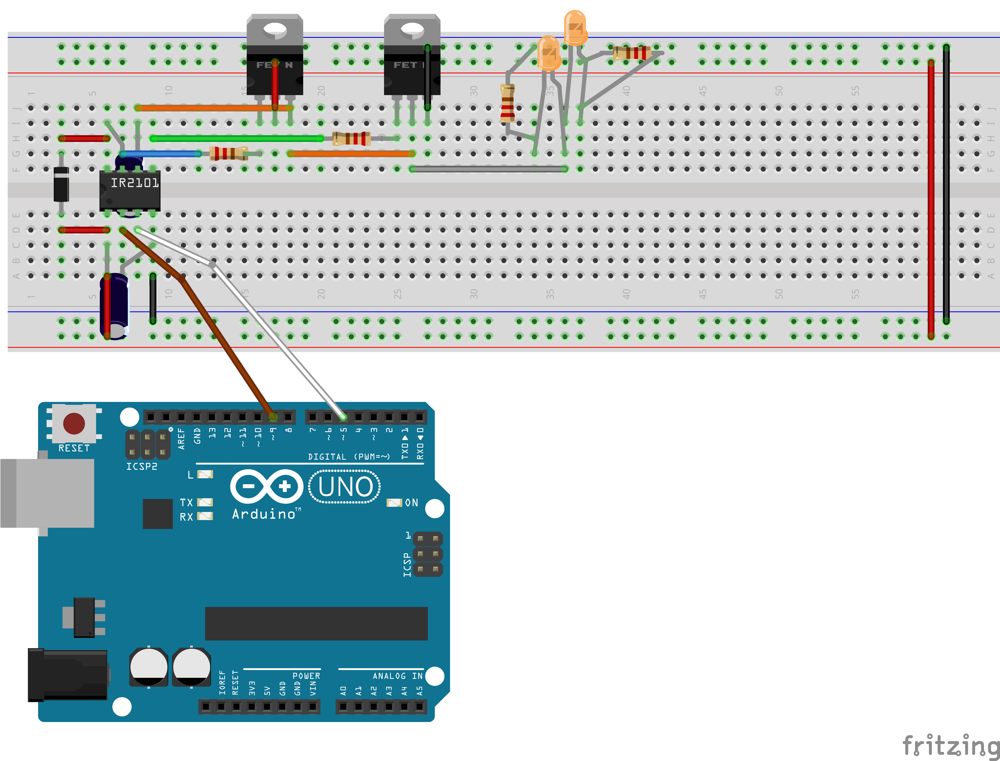
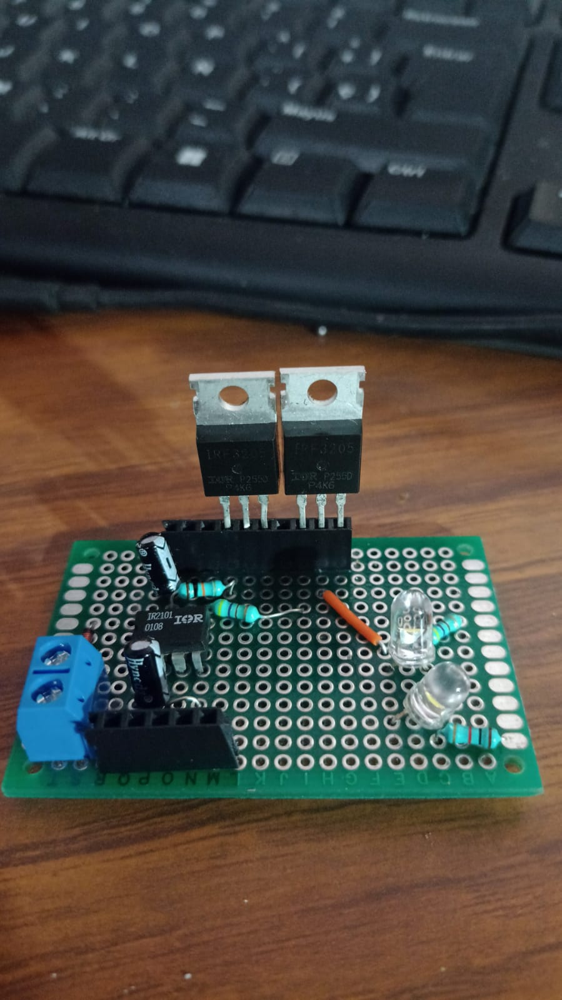
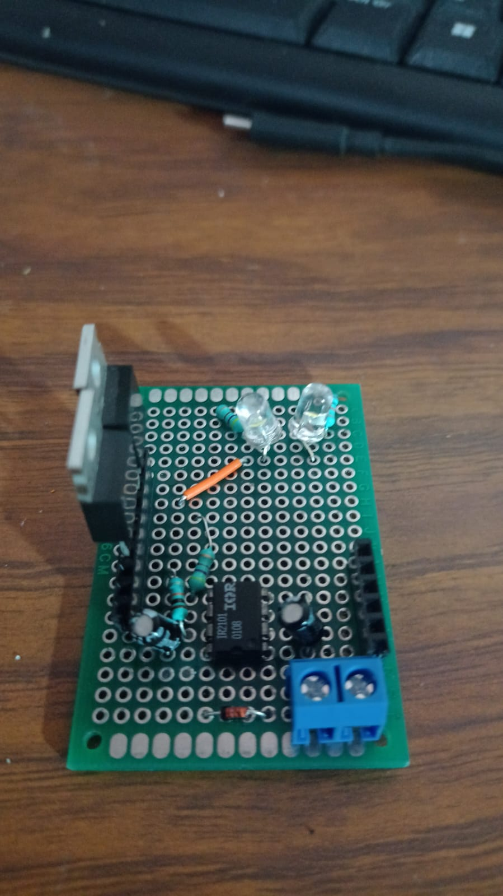
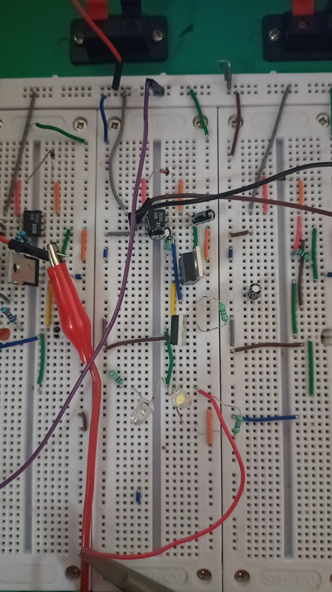

# SPWM — Portadora, Duty Cycle y PWM

Este documento explica los conceptos base detrás del inversor SPWM (medio puente IR2101 + IRF3205): qué es la portadora, por qué es triangular, y cómo su comparación contra la señal senoidal genera el PWM que finalmente mueve el voltaje entre 0V y Vdc.

## Animación: portadora vs senoidal vs salida PWM

- **Azul** — la senoidal de referencia (moduladora). Su frecuencia es la **frecuencia de salida** que quieres entregarle a la carga (ej. 60Hz).
- **Gris** — la portadora triangular. Su frecuencia es la **frecuencia de conmutación** de los MOSFETs (ej. 1kHz en las pruebas de banco, mucho más alta que la senoidal).
- **Naranja** — la salida PWM: se pone en ALTO cuando la senoidal está por encima de la triangular, y en BAJO cuando la triangular está por encima de la senoidal.

La animación se repite en loop mostrando un ciclo completo de la senoidal (0 → pico positivo → 0 → pico negativo → 0), con la portadora oscilando muchas veces más rápido dentro de ese mismo ciclo.

## ¿Qué es la portadora y por qué es triangular?

La **portadora (carrier)** es la señal de referencia rápida que oscila en el tiempo a una frecuencia fija — los Hz a los que "vibra" — y contra la que se compara la señal que en verdad quieres generar (la senoidal). No transporta información por sí misma: es solo una regla de tiempo uniforme.

Se usa **triangular** (y no otra forma) porque su pendiente es lineal y constante en cada subida y bajada. Eso hace que el tiempo que la senoidal pasa por encima de ella sea **directamente proporcional** a qué tan alto está el valor de la senoidal en ese instante. Si la portadora tuviera otra forma (diente de sierra, otra senoidal, etc.), esa proporcionalidad se pierde y la señal reconstruida se distorsiona.

**Los Hz de la portadora = cuántas veces oscila por segundo = cuántos pulsos PWM genera por segundo.** Cada oscilación completa de la triangular (un ciclo) da lugar a un pulso de la salida PWM.

## Duty cycle: cómo el voltaje empieza en cero, sube y baja

Cada pulso individual del PWM tiene esta forma:

- El pulso **empieza en 0V**.
- **Sube a Vdc** en el instante donde la senoidal cruza por encima de la portadora.
- **Se mantiene en Vdc** mientras la senoidal siga por encima de la portadora.
- **Baja de nuevo a 0V** en el instante donde la portadora vuelve a superar a la senoidal.
- El **duty cycle** es la fracción de ese periodo que el pulso pasó en alto: `duty = t_ON / T`.

## Por qué el ancho de pulso varía con el tiempo

Dentro de un ciclo completo de la senoidal:

| Punto de la senoidal | Duty cycle resultante | Ancho de pulso |
|---|---|---|
| Cruce por cero | ~50% (bipolar) | Pulso medio, ni angosto ni ancho |
| Cerca del pico positivo | Duty alto | Pulso ancho (casi todo el periodo en Vdc) |
| Cerca del pico negativo | Duty bajo | Pulso angosto (casi todo el periodo en 0V) |

Es exactamente ese cambio gradual de ancho, pulso a pulso, lo que — una vez promediado por un filtro LC a la salida — reconstruye la forma senoidal completa a partir de pulsos que solo tienen dos niveles posibles (0V y Vdc).

## Relación entre las dos frecuencias

- **Frecuencia de la portadora (conmutación):** qué tan rápido conmutan los MOSFETs. Determina cuántos pulsos hay por cada ciclo de salida — más alta = más resolución para aproximar la senoidal, pero más pérdidas de conmutación en los MOSFETs.
- **Frecuencia de la senoidal (salida):** la frecuencia real que le llega a la carga/motor.
- En un inversor real, la portadora suele ser **10 a 100 veces más rápida** que la frecuencia de salida deseada.

## Circuito de prueba (medio puente)

Montaje usado para todas las capturas de osciloscopio de este documento: un medio puente con **IR2101** como gate driver y **2 MOSFETs** (high-side / low-side), cada uno con un LED indicador en su rama para ver visualmente la conmutación alternada. El Arduino controla las entradas **HIN (pin 9)** y **LIN (pin 5)** del IR2101, generando la señal PWM con deadtime que luego se compara contra la tabla de duty interpolada para aproximar el SPWM.

- **Nodo de salida** (entre los dos MOSFETs): punto de medición del osciloscopio, y el punto que en un inversor real iría hacia la carga o una fase del motor.
- **LEDs indicadores**: confirman visualmente que high-side y low-side conmutan de forma alternada, sin traslape (shoot-through).

<<<<<<< HEAD
## Prototipo soldado

Versión soldada del mismo medio puente sobre placa perforada (protoboard de baquelita), migrada desde el breadboard de pruebas: **IR2101**, 2x **IRF3205** (con disipador), diodo y capacitor de bootstrap, 2 LEDs indicadores de conmutación, y bloque de terminales azul para la entrada de alimentación (en vez del jack barrel).

  
  

## Prueba en banco con osciloscopio

Montaje de validación con la placa soldada, puntas de osciloscopio (caimanes) conectadas al nodo de salida del medio puente y a GND común, usado para las capturas de forma de onda de este documento.

=======
>>>>>>> 4b1588eaea79b9cffa5fbf08383ca22a1b6bf51e
## Glosario rápido

| Término | Significado |
|---|---|
| Portadora / carrier | Señal triangular de referencia, define la frecuencia de conmutación |
| Moduladora / referencia | Señal senoidal que se quiere reproducir, define la frecuencia de salida |
| Duty cycle | Fracción del periodo que el pulso está en alto (`t_ON / T`) |
| PWM | Modulación por ancho de pulso — codifica un valor promedio variando el ancho del pulso |
| SPWM | PWM cuyo duty cycle sigue una envolvente senoidal |
| Deadtime | Pausa entre apagar un MOSFET y encender el complementario, evita shoot-through |
| Shoot-through | Falla donde ambos MOSFETs de una rama conducen a la vez (corto) |
